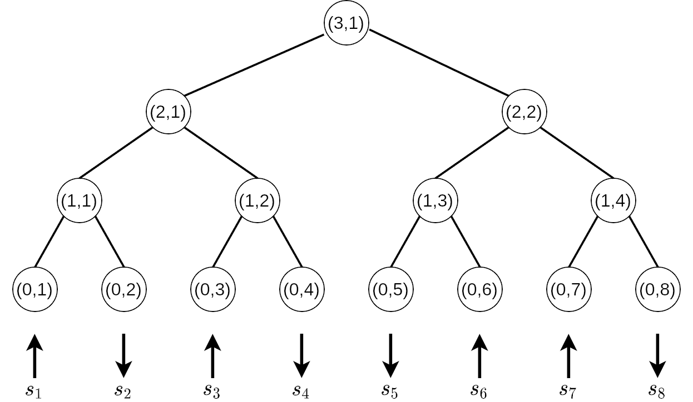

# The Hierarchical Parity Model
Code repository for the paper "The Hierarchical Parity Model: A Computationally Tractable Spin-Glass"

## Introduction
This repository contains the code used for the numerical analyses of the hierarchical parity model.

## Contents
The key contents of this repository are:
- `hierarchical parity model.ipynb` A Python Jupyter notebook which contains code used to perform the numerical analyses in the paper.
- `utils.py` a Python script containing useful helper functions.

## Installation
The Jupyter notebook `hierarchical parity model.ipynb` requires that [Google Jax](https://github.com/google/jax) be installed (the installation instructions are system-dependent and may be found on the Jax website). The other necessary packages may be installed by running `pip install -r requirements.txt`. It is recommended to perform the Python installation within a virtual environment.

## License
This code is provided under the MIT license. See `LICENSE` for more information.

## Contact
Developed by Gavin Hartnett (email: hartnett@rand.org).
